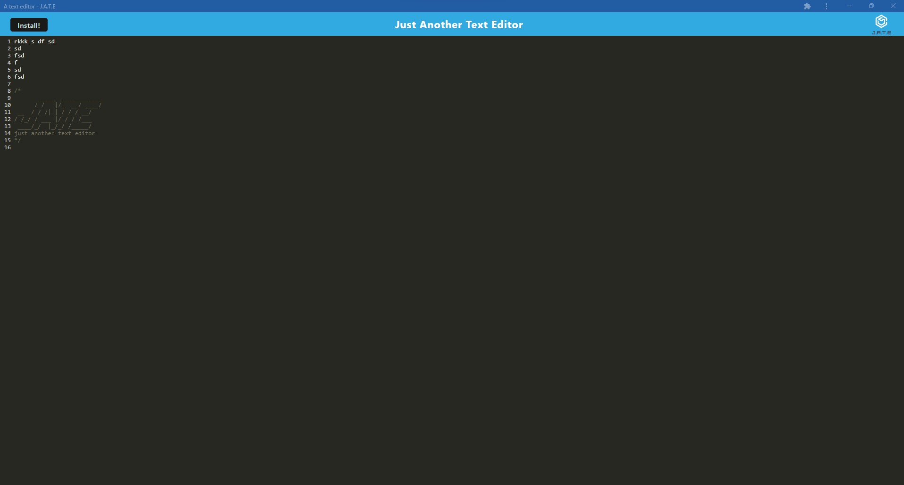

# Kristers Progressive Text Editor
      

  
  ## Description
  The Progressive Text Editor shows some of my newly learned skills working with an progressive web application, service worker, webpack, and caching static assets. I have learned an introduction in how I can build a PWA.
  
  ## Table of Contents
  * [Installation](#installation)
  * [Usage](#usage)
  * [Credits](#credits)
  * [License](#license)
  * [Contributing](#contributing)
  * [Questions](#questions)

  ## Installation
  Download and install folder, install node and run npm i, then npm start in the integrated terminal. Then go to your localhost in browser.

  Github Repository: https://github.com/kristermyr/Progressive-text-editor
  Heroku: https://kristersprogressivetexteditor.herokuapp.com/

  ## Usage
  
  

  ## Credits
    Bootcamp PWA Mini Project and other class activities (05,10,15,17,23)

  ## Collaborators
 * Miguel Montenegro https://github.com/Darkunitx
 * Nicholas Mamberger https://github.com/NickHM05
 * Dylan Quaale https://github.com/dylanquaale

  ## License
  MIT

  ## Contributing
  Create a new branch and submit a pull request

  ## Questions
  Github Username: kristermyr
  Please send me an E-mail if you have any questions [here](mailto:krister90@gmail.com) or visit https://github.com/kristermyr

